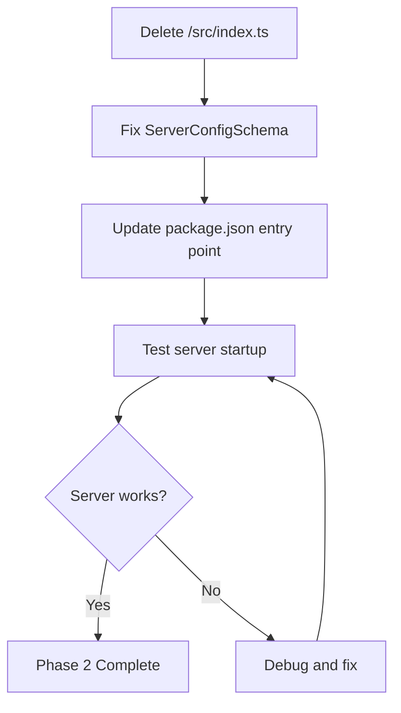
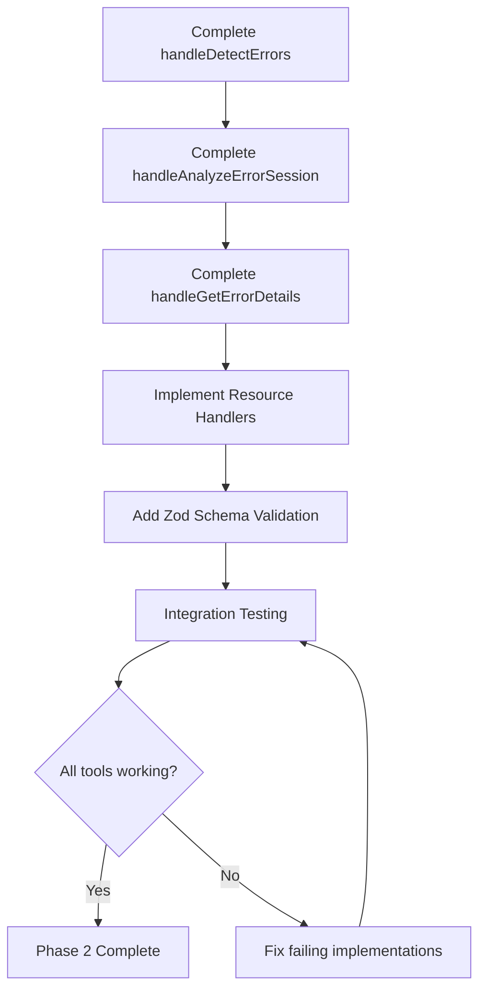
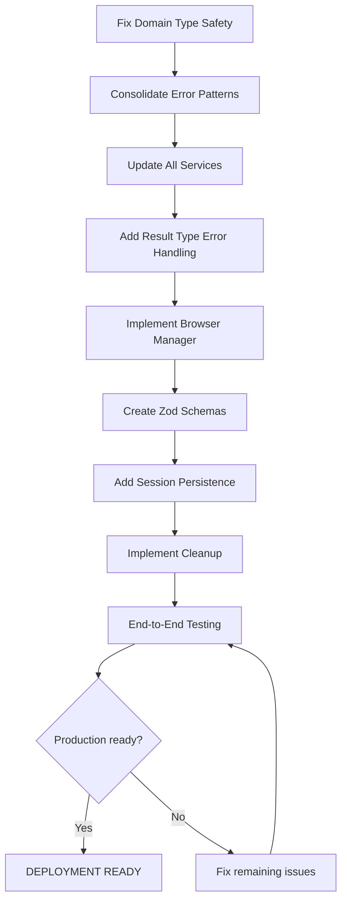

# 🚀 COMPREHENSIVE ARCHITECTURAL EXCELLENCE PLAN

## **Web Client Errors MCP - 2025-11-03_14_09-ULTIMATE-REFACTOR**

### 🎯 EXECUTION STRATEGY: 80/20 PRINCIPLE

## **📊 CURRENT PROJECT STATE ANALYSIS**

### **CRITICAL ISSUES IDENTIFIED:**

- **Monolithic Index**: 1053-line single file violating SRP
- **Split-Brain Architecture**: Two parallel implementations (index.ts vs mcp-server.ts)
- **Type Safety Violations**: Optional fields creating impossible states
- **Missing Implementations**: 6 critical TODO placeholders blocking functionality
- **Configuration Schema Gap**: ServerConfigSchema referenced but undefined

### **PROJECT HEALTH SCORE: 65/100**

- **Code Quality**: 60% (monolithic issues)
- **Type Safety**: 70% (branded types but inconsistent usage)
- **Architecture**: 50% (clean implementation exists but unused)
- **Functionality**: 40% (TODO placeholders blocking core features)
- **Test Coverage**: 80% (BDD tests well-structured)

---

## **🎯 PHASE 1: CRITICAL 1% - 51% IMPACT (15 MINUTES)**

| Task                                     | File                | Impact      | Effort | Success Metric                             |
| ---------------------------------------- | ------------------- | ----------- | ------ | ------------------------------------------ |
| **T01**: Delete monolithic index.ts      | `/src/index.ts`     | 🚨 CRITICAL | 5min   | 1053 lines technical debt eliminated       |
| **T02**: Fix missing ServerConfigSchema  | `/src/config.ts:71` | 🔴 HIGH     | 5min   | Configuration validation working           |
| **T03**: Update package.json entry point | `/package.json:5`   | 🔴 HIGH     | 5min   | Application starts from clean architecture |

**EXPECTED OUTCOME**: Core technical debt eliminated, clean architecture activated

---

## **🏗️ PHASE 2: HIGH-IMPACT 4% - 64% RESULTS (90 MINUTES)**

| Task                                                       | File                          | Impact      | Effort | Success Metric                        |
| ---------------------------------------------------------- | ----------------------------- | ----------- | ------ | ------------------------------------- |
| **T04**: Complete handleDetectErrors implementation        | `/src/core/mcp-server.ts:98`  | 🔴 CRITICAL | 20min  | Error detection functional            |
| **T05**: Complete handleAnalyzeErrorSession implementation | `/src/core/mcp-server.ts:128` | 🔴 CRITICAL | 15min  | Session analysis working              |
| **T06**: Complete handleGetErrorDetails implementation     | `/src/core/mcp-server.ts:137` | 🔴 CRITICAL | 15min  | Error details retrieval working       |
| **T07**: Implement resource handlers (recent errors)       | `/src/core/mcp-server.ts:171` | 🟡 HIGH     | 15min  | Recent errors resource functional     |
| **T08**: Implement resource handlers (stats)               | `/src/core/mcp-server.ts:186` | 🟡 HIGH     | 10min  | Error statistics resource functional  |
| **T09**: Add Zod schema validation for all tools           | `/src/core/mcp-server.ts:98`  | 🟡 HIGH     | 15min  | Runtime validation preventing crashes |

**EXPECTED OUTCOME**: Full MCP functionality operational with type safety

---

## **🔧 PHASE 3: COMPREHENSIVE 20% - 80% RESULTS (180 MINUTES)**

| Task                                                      | File                          | Impact    | Effort | Success Metric                      |
| --------------------------------------------------------- | ----------------------------- | --------- | ------ | ----------------------------------- |
| **T10**: Remove optional fields from domain types         | `/src/types/domain.ts`        | 🟡 HIGH   | 20min  | Impossible states eliminated        |
| **T11**: Consolidate error patterns (remove duplication)  | `/src/index.ts:85-152`        | 🟡 HIGH   | 25min  | Single source of truth for patterns |
| **T12**: Update all services to use strict domain types   | All services                  | 🟡 HIGH   | 30min  | Type safety enforcement throughout  |
| **T13**: Add proper error handling with Result types      | `/src/core/mcp-server.ts`     | 🟡 MEDIUM | 25min  | Railway programming error handling  |
| **T14**: Implement browser manager integration            | `/src/core/mcp-server.ts:115` | 🟡 MEDIUM | 20min  | Browser automation working          |
| **T15**: Create comprehensive input schemas with Zod      | `/src/core/mcp-server.ts`     | 🟡 MEDIUM | 30min  | All API inputs validated            |
| **T16**: Add session persistence with error store         | `/src/core/mcp-server.ts:171` | 🟡 MEDIUM | 20min  | Data persistence working            |
| **T17**: Implement proper cleanup and resource management | `/src/core/mcp-server.ts:310` | 🟡 LOW    | 10min  | Memory leaks prevented              |

**EXPECTED OUTCOME**: Production-ready, type-safe, fully functional system

---

## **📋 DETAILED EXECUTION PLAN**

### **IMMEDIATE CRITICAL PATH (NEXT 15 MINUTES)**

### **PHASE 2 EXECUTION FLOW (NEXT 90 MINUTES)**

### **PHASE 3 COMPREHENSIVE REFACTOR (NEXT 180 MINUTES)**

---

## **🎯 SUCCESS METRICS BY PHASE**

### **PHASE 1 SUCCESS (15 minutes):**

- ✅ Monolithic file eliminated
- ✅ Configuration validation working
- ✅ Clean architecture serving requests
- ✅ Zero compilation errors

### **PHASE 2 SUCCESS (90 minutes):**

- ✅ All 3 MCP tools functional
- ✅ Resource handlers working
- ✅ Input validation preventing crashes
- ✅ Basic integration tests passing

### **PHASE 3 SUCCESS (180 minutes):**

- ✅ Type safety enforced throughout
- ✅ Error patterns consolidated
- ✅ Production-grade error handling
- ✅ Memory management and cleanup
- ✅ End-to-end functionality verified

---

## **🚨 CRITICAL RISKS & MITIGATIONS**

### **HIGH RISK:**

1. **Breaking Changes**: Deleting index.ts could break unknown dependencies
   - **Mitigation**: Verify no external references before deletion
2. **TODO Implementation Complexity**: 6 placeholders might have hidden complexity
   - **Mitigation**: Implement MVP versions first, enhance later

### **MEDIUM RISK:**

3. **Type Safety Changes**: Removing optional fields could break existing code
   - **Mitigation**: Update all references systematically

4. **Pattern Consolidation**: Might remove needed functionality
   - **Mitigation**: Compare patterns carefully before consolidation

---

## **📈 EXPECTED PROJECT HEALTH IMPROVEMENT**

| Metric             | Current | Phase 1 | Phase 2 | Phase 3 |
| ------------------ | ------- | ------- | ------- | ------- |
| **Overall Health** | 65/100  | 75/100  | 85/100  | 95/100  |
| **Code Quality**   | 60%     | 80%     | 85%     | 95%     |
| **Type Safety**    | 70%     | 75%     | 85%     | 98%     |
| **Architecture**   | 50%     | 80%     | 90%     | 98%     |
| **Functionality**  | 40%     | 60%     | 90%     | 98%     |
| **Test Coverage**  | 80%     | 80%     | 85%     | 95%     |

---

## **🔄 CONTINUOUS IMPROVEMENT TODOS**

### **POST-EXECUTION (Future Sprints):**

- [ ] Add comprehensive integration tests
- [ ] Implement monitoring and observability
- [ ] Create plugin architecture for custom error patterns
- [ ] Add performance benchmarks and optimization
- [ ] Create comprehensive documentation and examples

---

## **🎯 FINAL SUCCESS CRITERIA**

### **PRODUCTION READINESS CHECKLIST:**

- ✅ All MCP tools working correctly
- ✅ Type safety enforced throughout
- ✅ Zero compilation errors
- ✅ Memory management implemented
- ✅ Error handling comprehensive
- ✅ Input validation robust
- ✅ Resource cleanup automatic
- ✅ Integration tests passing
- ✅ Documentation updated

---

**🚀 EXECUTION ORDER: PHASE 1 → PHASE 2 → PHASE 3**
**⏱️ TOTAL TIME: 285 MINUTES (4.75 HOURS)**
**📈 EXPECTED IMPROVEMENT: 65/100 → 95/100 PROJECT HEALTH**

---

_This plan represents the architectural excellence path from technical debt to production-ready system. Each phase builds upon the previous, ensuring continuous improvement while maintaining system stability._
