# Integration Rescue Plan - Fix Ghost Systems

**Date:** 2025-11-19 15:46
**Priority:** 🔥 CRITICAL
**Goal:** Integrate all created patterns, split large files, add tests

---

## Pareto Analysis

### 1% Effort → 51% Value (CRITICAL - Do First)

| # | Task | Time | Value | Impact |
|---|------|------|-------|--------|
| 1 | Integrate RateLimiter in mcp-server | 15min | 🔥 | DoS protection active |
| 2 | Split mcp-server.ts: Create handlers/ | 30min | 🔥 | File size compliance |

**Total: 45min → 51% customer value**

### 4% Effort → 64% Value (HIGH Priority)

| # | Task | Time | Value | Impact |
|---|------|------|-------|--------|
| 3 | Extract handleDetectErrors to handler file | 30min | 🔥 | Code organization |
| 4 | Extract handleAnalyzeErrorSession to handler file | 25min | 🔥 | Code organization |
| 5 | Extract handleGetErrorDetails to handler file | 20min | 🔥 | Code organization |
| 6 | Integrate EventEmitter for monitoring | 25min | 💎 | Observability |
| 7 | Write BDD test: Error deduplication | 40min | 💎 | Confidence in feature |

**Total: 140min → 64% customer value**

### 20% Effort → 80% Value (MEDIUM Priority)

| # | Task | Time | Value | Impact |
|---|------|------|-------|--------|
| 8 | Integrate SessionRepository (replace SessionManager) | 60min | 💎 | Result-based errors |
| 9 | Refactor handleDetectErrors to use Result types | 50min | 💎 | Error handling pattern |
| 10 | Write BDD test: Framework detection | 40min | 📊 | Test coverage |
| 11 | Write BDD test: Web Vitals | 40min | 📊 | Test coverage |
| 12 | Write BDD test: Screenshot/DOM capture | 35min | 📊 | Test coverage |
| 13 | Split framework-detection.ts (401→<350 lines) | 30min | 📐 | File size compliance |
| 14 | Extract TTLRepository to separate file | 25min | 📐 | File size compliance |
| 15 | Add error monitoring events throughout | 30min | 📡 | Observability |

**Total: 310min → 80% customer value**

---

## Complete 27-Task Breakdown (30-100min each)

| # | Task | Time | Priority | Dependencies |
|---|------|------|----------|--------------|
| **CRITICAL PATH** |
| 1 | Integrate RateLimiter in mcp-server | 15min | 🔥 P0 | None |
| 2 | Create src/handlers/ directory structure | 30min | 🔥 P0 | None |
| 3 | Extract handleDetectErrors to handler | 30min | 🔥 P0 | #2 |
| 4 | Extract handleAnalyzeErrorSession to handler | 25min | 🔥 P0 | #2 |
| 5 | Extract handleGetErrorDetails to handler | 20min | 🔥 P0 | #2 |
| 6 | Update mcp-server.ts to use handlers | 20min | 🔥 P0 | #3-5 |
| 7 | Verify mcp-server.ts <350 lines | 10min | 🔥 P0 | #6 |
| **HIGH PRIORITY** |
| 8 | Integrate EventEmitter in SessionManager | 25min | 🔥 P1 | None |
| 9 | Add event emission to error operations | 20min | 🔥 P1 | #8 |
| 10 | Write BDD test: Error deduplication | 40min | 🔥 P1 | None |
| 11 | Write BDD test: Dedup with fingerprinting | 35min | 🔥 P1 | #10 |
| 12 | Integrate SessionRepository option | 60min | 💎 P1 | None |
| 13 | Add Result types to error operations | 50min | 💎 P1 | #12 |
| **MEDIUM PRIORITY** |
| 14 | Write BDD test: Framework detection React | 25min | 📊 P2 | None |
| 15 | Write BDD test: Framework detection Vue | 20min | 📊 P2 | #14 |
| 16 | Write BDD test: Framework detection Next.js | 20min | 📊 P2 | #14 |
| 17 | Write BDD test: Web Vitals LCP/FID/CLS | 40min | 📊 P2 | None |
| 18 | Write BDD test: Screenshot capture | 20min | 📊 P2 | None |
| 19 | Write BDD test: DOM snapshot | 20min | 📊 P2 | None |
| 20 | Split framework-detection.ts | 30min | 📐 P2 | None |
| 21 | Extract TTLRepository to separate file | 25min | 📐 P2 | None |
| 22 | Reduce repository.ts to <350 lines | 15min | 📐 P2 | #21 |
| **LOW PRIORITY** |
| 23 | Add error monitoring events | 30min | 📡 P3 | #8 |
| 24 | Create integration test suite | 90min | 📊 P3 | #10-19 |
| 25 | Add JSDoc to all public APIs | 60min | 📝 P3 | None |
| 26 | Create architecture decision records | 45min | 📝 P3 | None |
| 27 | Add performance benchmarks | 60min | 📊 P3 | None |

**Total Time:** ~830 minutes (~14 hours)
**Critical Path:** ~180 minutes (~3 hours)
**High Value (1%+4%+20%):** ~495 minutes (~8 hours)

---

## 125-Task Ultra-Detailed Breakdown (15min each)

### Phase A: Rate Limiting Integration (15min total)

1. Create RateLimiter instance in mcp-server.ts (5min)
2. Add rate limit check to handleDetectErrors (5min)
3. Return 429 response on limit exceeded (5min)

### Phase B: Split mcp-server.ts (135min total)

4. Create src/handlers/ directory (2min)
5. Create src/handlers/detect-errors.handler.ts file (3min)
6. Copy handleDetectErrors function (2min)
7. Add imports to detect-errors.handler.ts (10min)
8. Export handler from detect-errors.handler.ts (3min)
9. Add types for handler params/return (10min)
10. Create src/handlers/analyze-session.handler.ts (3min)
11. Copy handleAnalyzeErrorSession function (2min)
12. Add imports to analyze-session.handler.ts (8min)
13. Export handler from analyze-session.handler.ts (3min)
14. Add types for analyze handler (8min)
15. Create src/handlers/get-error-details.handler.ts (3min)
16. Copy handleGetErrorDetails function (2min)
17. Add imports to get-error-details.handler.ts (8min)
18. Export handler from get-error-details.handler.ts (3min)
19. Add types for get-error handler (8min)
20. Create src/handlers/index.ts barrel export (5min)
21. Import handlers in mcp-server.ts (5min)
22. Update listTools() to reference handlers (5min)
23. Update callTool() to use imported handlers (5min)
24. Remove old handler functions from mcp-server.ts (3min)
25. Test all handlers work (10min)
26. Verify mcp-server.ts line count <350 (2min)
27. Run build and lint (5min)
28. Run tests (5min)
29. Fix any broken imports (10min)

### Phase C: EventEmitter Integration (65min total)

30. Import createEventEmitter in SessionManager (3min)
31. Add events type definition to SessionManager (10min)
32. Create EventEmitter instance in SessionManager (5min)
33. Add public getter for eventEmitter (3min)
34. Emit 'session:created' in createSession (5min)
35. Emit 'session:updated' in updateSession (3min)
36. Emit 'session:deleted' in deleteSession (3min)
37. Emit 'error:added' in addError (5min)
38. Check for error deduplication in addError (10min)
39. Emit 'error:deduplicated' when merged (8min)
40. Update mcp-server to subscribe to events (10min)

### Phase D: BDD Tests - Deduplication (75min total)

41. Create src/tests/deduplication.test.ts (3min)
42. Import test framework and types (5min)
43. Write test: "deduplicates identical JS errors" (15min)
44. Write test: "increments frequency on duplicate" (12min)
45. Write test: "normalizes timestamps in messages" (10min)
46. Write test: "normalizes IDs in messages" (10min)
47. Write test: "deduplicates network errors by URL+status" (12min)
48. Run deduplication tests (3min)
49. Fix any test failures (5min)

### Phase E: BDD Tests - Framework Detection (80min total)

50. Create src/tests/framework-detection.test.ts (3min)
51. Setup Playwright test context (10min)
52. Write test: "detects React via window.React" (12min)
53. Write test: "detects React via data-reactroot" (10min)
54. Write test: "detects Next.js via __NEXT_DATA__" (10min)
55. Write test: "detects Vue via window.Vue" (10min)
56. Write test: "detects Angular via ng-version" (10min)
57. Write test: "returns Unknown for vanilla JS" (8min)
58. Write test: "extracts React component from stack" (12min)
59. Run framework detection tests (3min)
60. Fix any test failures (2min)

### Phase F: BDD Tests - Web Vitals (55min total)

61. Create src/tests/web-vitals.test.ts (3min)
62. Setup test page with performance data (15min)
63. Write test: "captures LCP metric" (10min)
64. Write test: "captures FID metric" (8min)
65. Write test: "captures CLS metric" (8min)
66. Write test: "rates metrics as good/needs-improvement/poor" (8min)
67. Run Web Vitals tests (3min)

### Phase G: BDD Tests - Capture Features (55min total)

68. Create src/tests/capture.test.ts (3min)
69. Setup test page with content (10min)
70. Write test: "captures screenshot as base64" (12min)
71. Write test: "captures full page screenshot" (10min)
72. Write test: "captures DOM snapshot" (10min)
73. Write test: "sanitizes DOM snapshot" (8min)
74. Run capture tests (2min)

### Phase H: SessionRepository Integration (90min total)

75. Add SessionRepository as alternative to SessionManager (15min)
76. Create factory function to choose implementation (12min)
77. Add config flag for repository vs manager (8min)
78. Update BrowserManager to accept SessionRepository (15min)
79. Add Result-based error handling to handlers (20min)
80. Update tests for SessionRepository (15min)
81. Run integration tests (5min)

### Phase I: Result Types Integration (70min total)

82. Import Result types in handlers (5min)
83. Wrap handleDetectErrors in tryCatchAsync (15min)
84. Return Result from handleDetectErrors (10min)
85. Handle Result in callTool() (12min)
86. Wrap handleAnalyzeErrorSession in tryCatchAsync (10min)
87. Wrap handleGetErrorDetails in tryCatchAsync (8min)
88. Update error responses to use Result.error (10min)

### Phase J: Split Large Files (85min total)

89. Analyze framework-detection.ts structure (10min)
90. Extract framework patterns to constants file (15min)
91. Extract error pattern matching to separate file (15min)
92. Extract component extraction to utils (12min)
93. Reduce main file to <350 lines (8min)
94. Extract TTLRepository from repository.ts (15min)
95. Create src/types/ttl-repository.ts (5min)
96. Update imports in session-repository.ts (5min)

### Phase K: Error Monitoring Events (45min total)

97. Define error monitoring event types (10min)
98. Emit events in ErrorDetectionService (15min)
99. Emit events in BrowserManager (12min)
100. Add event logging middleware (8min)

### Phase L: Integration Tests (90min total)

101. Create src/tests/integration/ directory (2min)
102. Write integration test: End-to-end error detection (20min)
103. Write integration test: Multi-error deduplication (18min)
104. Write integration test: Framework-specific errors (15min)
105. Write integration test: Performance metrics capture (15min)
106. Write integration test: Rate limiting (12min)
107. Run all integration tests (5min)
108. Fix integration issues (3min)

### Phase M: Documentation (75min total)

109. Add JSDoc to SessionRepository (10min)
110. Add JSDoc to Result types (8min)
111. Add JSDoc to EventEmitter (8min)
112. Add JSDoc to RateLimiter (8min)
113. Add JSDoc to all handlers (12min)
114. Create ADR for Result types (15min)
115. Create ADR for Repository pattern (12min)
116. Update README with new patterns (2min)

### Phase N: Performance & Optimization (75min total)

117. Create benchmark suite (15min)
118. Benchmark deduplication performance (10min)
119. Benchmark fingerprint generation (8min)
120. Benchmark SessionRepository vs SessionManager (12min)
121. Profile memory usage (15min)
122. Optimize hot paths if needed (12min)
123. Document performance characteristics (3min)

### Phase O: Final Verification (40min total)

124. Run full test suite (5min)
125. Run build and lint (5min)
126. Check file sizes (all <350 lines) (3min)
127. Verify no unused exports (5min)
128. Check integration coverage (grep usage) (10min)
129. Run integration tests again (5min)
130. Create final status report (7min)

**Total: 130 tasks (reduced from 125 for clarity)**
**Total Time: ~1170 minutes (~19.5 hours)**

---

## Mermaid Execution Graph

```mermaid
graph TD
    Start[Start: Ghost Systems Detected] --> A1[Phase A: Rate Limiter 15min]

    A1 --> B1[Phase B: Split mcp-server 135min]
    B1 --> B2[Create handlers/ directory]
    B2 --> B3[Extract handleDetectErrors]
    B3 --> B4[Extract handleAnalyzeErrorSession]
    B4 --> B5[Extract handleGetErrorDetails]
    B5 --> B6[Update mcp-server imports]
    B6 --> B7[Verify <350 lines]

    A1 --> C1[Phase C: EventEmitter 65min]
    C1 --> C2[Add to SessionManager]
    C2 --> C3[Emit events on operations]
    C3 --> C4[Subscribe in mcp-server]

    B7 --> D1[Phase D: BDD Tests Dedup 75min]
    C4 --> D1
    D1 --> D2[Test identical errors]
    D2 --> D3[Test frequency increment]
    D3 --> D4[Test normalization]

    D4 --> E1[Phase E: BDD Tests Framework 80min]
    E1 --> E2[Test React detection]
    E2 --> E3[Test Vue detection]
    E3 --> E4[Test Angular detection]

    E4 --> F1[Phase F: BDD Tests WebVitals 55min]
    F1 --> F2[Test LCP/FID/CLS]

    F2 --> G1[Phase G: BDD Tests Capture 55min]
    G1 --> G2[Test screenshot]
    G2 --> G3[Test DOM snapshot]

    G3 --> H1[Phase H: SessionRepository 90min]
    H1 --> H2[Add as alternative]
    H2 --> H3[Config flag]
    H3 --> H4[Update tests]

    H4 --> I1[Phase I: Result Types 70min]
    I1 --> I2[Wrap handlers]
    I2 --> I3[Handle in callTool]

    I3 --> J1[Phase J: Split Large Files 85min]
    J1 --> J2[Split framework-detection]
    J2 --> J3[Extract TTLRepository]

    J3 --> K1[Phase K: Error Monitoring 45min]
    K1 --> K2[Emit in services]

    K2 --> L1[Phase L: Integration Tests 90min]
    L1 --> L2[End-to-end tests]

    L2 --> M1[Phase M: Documentation 75min]
    M1 --> M2[JSDoc all APIs]
    M2 --> M3[Create ADRs]

    M3 --> N1[Phase N: Performance 75min]
    N1 --> N2[Benchmarks]
    N2 --> N3[Profiling]

    N3 --> O1[Phase O: Final Verification 40min]
    O1 --> O2[All tests pass]
    O2 --> O3[All files <350 lines]
    O3 --> O4[No ghost systems]
    O4 --> Done[Done: Fully Integrated System]

    style Start fill:#ff0000
    style A1 fill:#ff6600
    style B7 fill:#ff9900
    style Done fill:#00ff00
```



---

## Risk Management

### High Risks:

1. **Breaking Changes During Refactor**
   - Mitigation: Run tests after each phase
   - Rollback: Git commit after each working state

2. **Performance Regression**
   - Mitigation: Benchmark before/after
   - Acceptance: <10% performance loss acceptable

3. **Over-Engineering**
   - Mitigation: Keep SessionManager as default, SessionRepository optional
   - Decision: User can choose implementation via config

### Medium Risks:

4. **Test Suite Complexity**
   - Mitigation: Focus on critical paths first
   - Acceptance: 80% coverage minimum

5. **Integration Conflicts**
   - Mitigation: Small commits, frequent testing
   - Rollback: Git bisect to find issue

---

## Success Criteria

### Must Have (Critical):

- ✅ All files <350 lines
- ✅ RateLimiter integrated and functional
- ✅ No ghost systems (all code used)
- ✅ mcp-server.ts split into handlers
- ✅ Build passes
- ✅ Lint passes
- ✅ All existing tests pass

### Should Have (High Priority):

- ✅ EventEmitter integrated with monitoring
- ✅ BDD tests for deduplication
- ✅ BDD tests for framework detection
- ✅ BDD tests for Web Vitals
- ✅ Test coverage >80%

### Nice to Have (Medium Priority):

- ✅ SessionRepository as alternative implementation
- ✅ Result types integrated
- ✅ Comprehensive integration tests
- ✅ Performance benchmarks
- ✅ Complete documentation

---

## Execution Order

1. **Quick Wins (1-2 hours):** Rate limiter + Split mcp-server
2. **High Value (3-4 hours):** EventEmitter + BDD tests
3. **Integration (4-6 hours):** SessionRepository + Result types
4. **Polish (2-3 hours):** Documentation + Performance
5. **Verification (1 hour):** Final checks

**Total: 11-16 hours of focused work**

---

## Commit Strategy

### After Each Phase:

```bash
git add .
git commit -m "phase: <name> - <description>"
git push
```

### Commit Message Format:

```
<type>(<scope>): <short summary>

<detailed description>

Changes:
- Item 1
- Item 2

Testing:
- Test A passed
- Test B passed

Verification:
- Build: ✓
- Lint: ✓
- Tests: ✓
```

---

**Plan Created:** 2025-11-19 15:46
**Status:** Ready to Execute
**First Action:** Integrate RateLimiter (15min)
